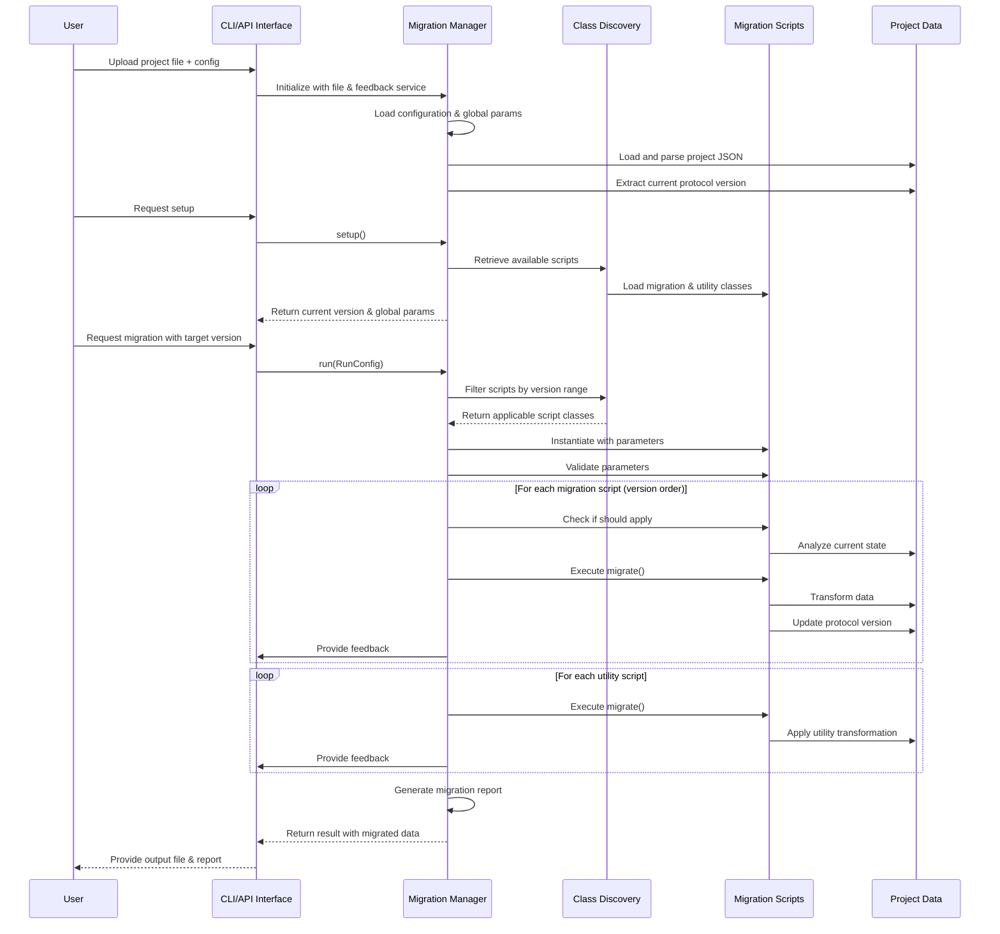

<h1 align="center">Hai, I'm Maya Holzer 👋🌸</h1>

  <em>20 years old 🌸 | Application Developer Apprentice @ <a href="https://www.knapp.com/">KNAPP AG</a>  | Based in Graz, Austria 🇦🇹</em>

   
<a href="https://www.common-ground.homes" target="_blank" align="center">
  
   
   
</a>

---

<h2 align="center">🛠️ Tech Stack</h2>

  
  

---

<h2 align="center">🚀 Projects I'm Proud Of</h2>

### 🏠 [Common Ground](common-ground.homes) - Flat Management App    `2025` `🚧 WIP 🚧`
Comprehensive mobile-first app that makes shared living actually enjoyable! Features collaborative shopping lists, expense tracking with automated debt calculations, real-time presence tracking, and receipt uploads.
> Angular 19 • Ionic 7 • Capacitor • Supabase • TypeScript • PostgreSQL

### 🤖 [AustriaSkills Robot WebInterface](https://github.com/H0lz3r-x64/AustriaSkills-Robot-WebInterface)    `2023`
Responsive web interface for monitoring and controlling competition robots, with real-time metrics and interactive path visualization. Built for both desktop and mobile browsers.
 My first real working web application.
> JavaScript • HTML/CSS • Canvas API • Real-time data

### 📊 [DB-Table-Export](https://github.com/H0lz3r-x64/DB-Table-Export) - Report Generation    `2023`
Customizable report generation for managing educational courses and apprentice data, creating self-contained HTML and PDF exports.
> Python • HTML • PDF generation

### 🔄 ProjectMigrater - Enterprise Migration System    `2025`
*(Department internal)* Comprehensive migration system for autonomous shuttle data, using versioned scripts to transform JSON/Protobuf between protocol versions. Focus on clean software design.
> Python • Flask • Angular • JSON • REST API

---

<h2 align="center">✨ Current Focus: Common Ground</h2>

A web-based app with mobile capabilities designed to simplify shared living arrangements. It centralizes all aspects of communal living, from scheduling and finances to shopping and tasks, making it easier for residents to stay organized and harmonious.

---

<h2 align="center">📈 GitHub Stats</h2>

  
   
  
  
<!--    -->

<h2 align="center">💭 About Me</h2>

- 🌱 Learning while trying to enjoy these formative years
- 🏠 Working on apps that actually help people in their daily lives
- 🧠 Interested in creating tech that makes life better, not profits!
- 🎨 Blend coding with creativity to solve real problems
- 🌍 Based in Graz but connected globally
- 🔮 Dream of building technology that encourages community and cooperation

---

<h2 align="center">📫 Let’s Connect!</h2>

  
   

---

  

  Built with 💖 by <strong>Maya Holzer</strong>.

