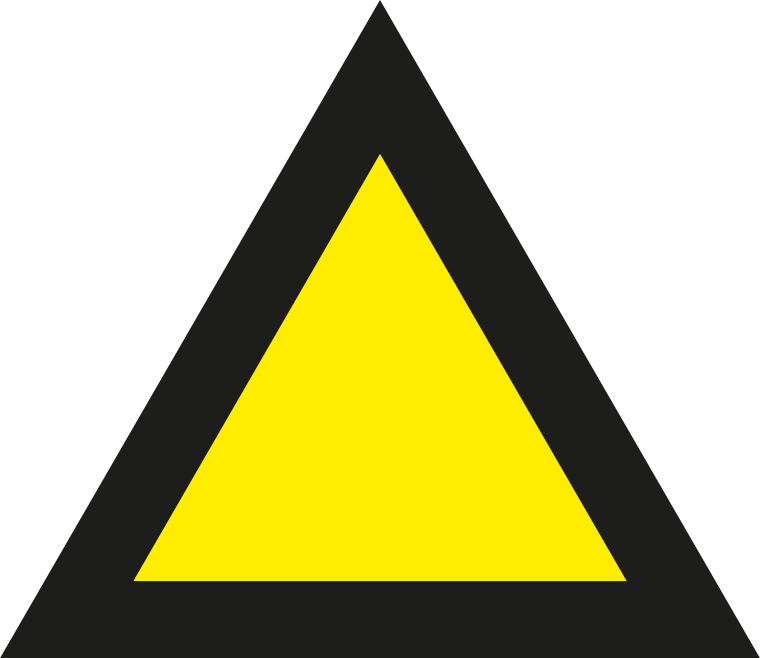
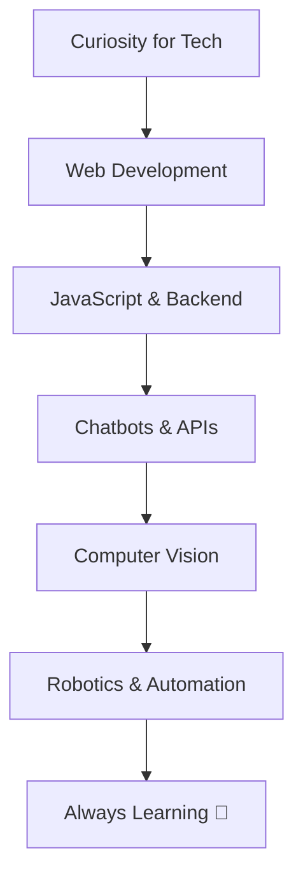

<h1 align="center">Hi there, I'm Maya Holzer 👋</h1>

  <em>20 years old 🌸 | Application Developer Apprentice at <a href="https://www.knapp.com/">KNAPP AG</a>  | Based in Graz, Austria 🇦🇹</em>

  

---

<h2 align="center">🛠️ Tech Stack</h2>

  
  

---

<h2 align="center">🚀 What I Do</h2>

- 🌐 **Web Development**: Building sleek and functional UIs and APIs.  
- 🎮 **Game Development**: Crafting interactive games (Unity, Godot).  
- 🤖 **Robotics**: Working on vision and motion control systems.  
- 🤖 **Bots and Automation**: Creating AI-driven bots for work and play.  
- 🌈 **Learning**: Always exploring new tech and ideas!  

---

<h2 align="center">📈 GitHub Stats</h2>

  
   
  
  
  

---

<h2 align="center">🌌 My Programming Journey</h2>

---

<h2 align="center">✨ Fun Facts</h2>

<!-- - 🎨 I enjoy blending tech and creativity to solve problems. 
- 🌍 Graz is my home, but I’m always connected to the world.  
- 💭 Dreaming of a future where I create games and bots that spark joy and wonder.  
-->
---

<h2 align="center">📫 Let’s Connect!</h2>

  
  

---

  

---

  Built with 💖 by <strong>Maya Holzer</strong>.

